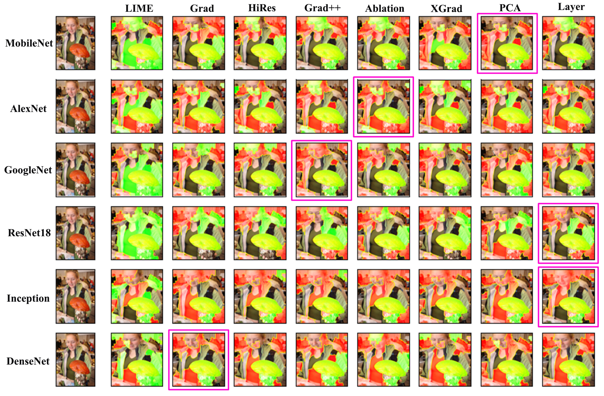
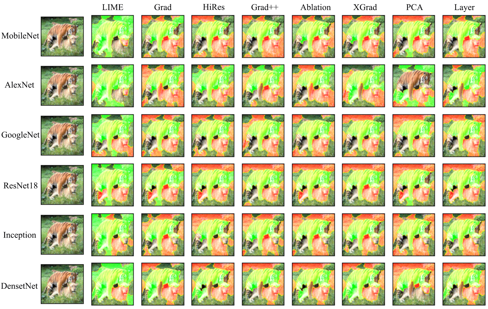
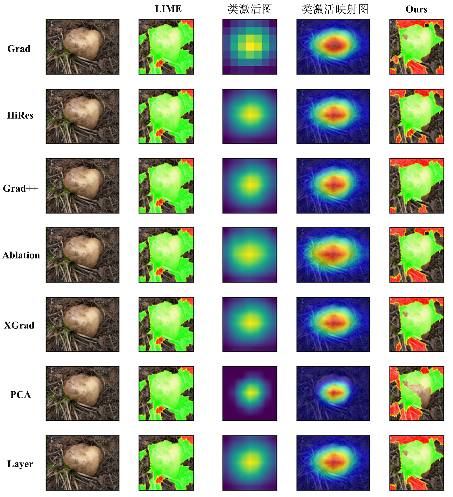
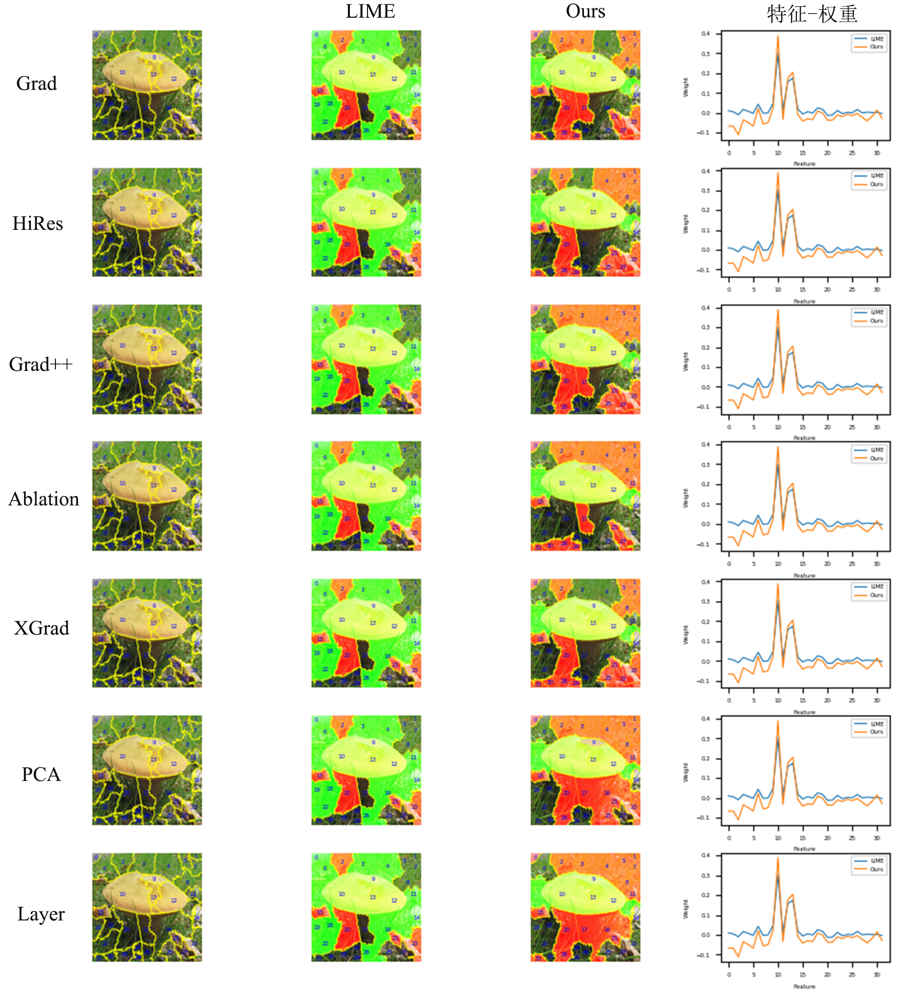
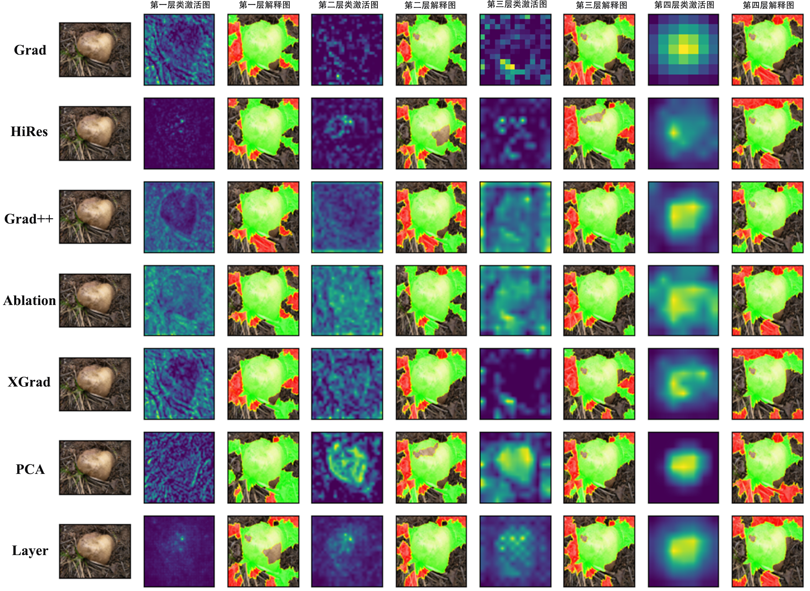
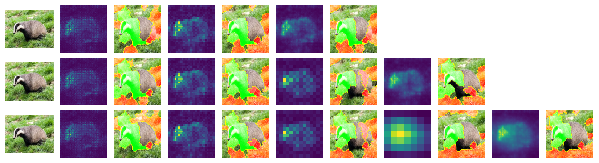

# 项目名称：CamLIME

本项目为论文 **《基于类激活的卷积神经网络局部解释方法研究》**（刘杰东，2025）中所提出方法的官方实现。我们提供了完整的实验代码、环境依赖配置以及运行流程，方便学术复现与二次研究。

> 论文链接：[arXiv / IEEE / ACM / Springer 链接]  
> 联系作者：[1041674453@qq.com]  
> 作者单位：[RAier/计算机科学与工程学院/西安理工大学]

---

## 项目结构说明

```bash
CamLIME/
├── imagenet/                 # ImageNet数据集的标注
├── test_img/                 # 用于代码测试的图片
├── odb_img/                  # 用于图像检测的样本 
├── lime/                     # lime的源码，含自重写 
├── pytorch_grad_cam/         # GradCam的源码，含自重写
├── quantus/                  # Quantus可解释性指标评估工具
├── MyOthersCode/             # CamLIME框架探索过程中其它测试代码，使用时取出放于项目根目录后再运行
├── requirements.txt          # Python依赖列表
├── CAM_LIME.py               # CamLIME核心代码
├── CAM_LIME_w_f.py           # 权重与超像素特征关系曲线
├── CAM_LIME_fues_act.py      # 多个特征层融合激活
├── my_difact.py              # CamLIME框架中不同激活模式对比效果
├── my_diflayer.py            # CamLIME框架中不同激活层对比效果
├── my_difact_diflayer.py     # CamLIME框架中不同激活模式及不同激活层双变量对比效果
├── my_difmodel.py            # CamLIME框架对不同黑盒模型的解释效果
├── my_difExp_vis.py          # CamLIME与部分解释方法的对比
├── my_metrics.py             # 基于Quantus重写的评价指标
├── my_Complexity.py          # CamLIME与其他解释方法的复杂度比较
├── my_Faithfulness.py        # CamLIME与其他解释方法的忠实性比较
├── Quantus_CamLime_all.py    # 用Quantus库测试CamLIME的六类指标分数
├── Quantus_CamLime_test.py   # CamLIME的特征工程应用
├── CamLIME_Face.py           # CamLIME的人脸识别应用
├── CamLIME_Obd.py            # CamLIME的目标检测应用
├── CamLIME_Seg.py            # CamLIME的图像分割应用
├── README.md                 # 项目说明文档
└── LICENSE                   # 开源许可证


```

---

## 环境依赖

本项目基于 Python 开发，推荐使用 Anaconda 或 Virtualenv 搭建虚拟环境。

### 核心依赖及版本（见 `requirements.txt`）：

```txt
python 3.8.18
torch 2.1.2+cu118
torchaudio 2.1.2+cu118
torchvision 0.16.2+cu118
lime  0.2.0.1
torchcam 0.4.0
grad-cam 1.4.5
captum 0.7.0
alibi 0.9.5
ttach 0.0.3
tensorflow 2.12.0  
typing-extensions 4.8
omnixai 1.3.1
zennit 0.5.1
```

### 创建并激活虚拟环境（可选）：

```bash
conda create -n CamLIME python=3.8
conda activate CamLIME
pip install -r requirements.txt
```

---

## 快速开始

### 1. 克隆仓库

```bash
git clone https://github.com/LiuJiedong-Coder/CamLIME.git
cd CamLIME
```

### 2. 下载数据（或使用说明）

请将数据集放置于 `data/` 目录下。

```txt
ImageNet2012数据集下载与处理参考：https://blog.csdn.net/weixin_47160526/article/details/132037269
```


### 3. 训练模型

```txt
python CAM_LIME.py

关键参数：
- 类激活模式选择
parser.add_argument('--method', type=str, default='gradcam',
                  choices=[
                        'gradcam', 'hirescam', 'gradcam++',
                        'scorecam', 'xgradcam', 'ablationcam',
                        'eigencam', 'eigengradcam', 'layercam',
                        'fullgrad', 'gradcamelementwise'
                  ],
                  help='CAM method')

- 黑盒模型与激活层选择推荐，模型根参数量由小到大
model_mob = models.mobilenet_v2(pretrained=True).eval().to(device)
model_alex = models.alexnet(pretrained=True).eval().to(device)
model_google = models.googlenet(pretrained=True).eval().to(device)
model_res18 = models.resnet18(pretrained=True).eval().to(device)
model1_inc = models.inception_v3(pretrained=True).eval().to(device)
model_dense = models.densenet121(pretrained=True).eval().to(device)
#model_vgg = models.vgg16(pretrained=True).eval().to(device)

target_layers_mob = [model_mob.features[17]]   #mobilenet
target_layers_alex = [model_alex.features[11]]   #alexnet
target_layers_google = [model_google.inception5b]   #googlenet
target_layers_res18 = [model_res18.layer4[-1]]   #resnet18,50
target_layers_inc = [model1_inc.Mixed_7c]   #inception_v3
target_layers_dense = [model_dense.features[-1]]  # vgg / densenet
#target_layers_vgg = [model_vgg.features[-1]]

- CamLIME关键代码与超参
from lime import lime_image_my
explainer = lime_image_my.LimeImageExplainer()
# batch_predict分类预测函数 #num_samples是邻域图像个数
data, labels = explainer.explain_instance_data_label(np.array(trans_C(img_pil)), batch_predict, top_labels=1, hide_color=0, num_samples=50)  
```

### 4. 解释效果评估

```txt
运行 my_Complexity.py、my_Faithfulness.py、Quantus_CamLime_all.py
使用时根据设备情况设置参数
```

---

## 部分实验效果展示

| 不同黑盒模型和不同类激活的解释 | 不同黑盒模型和不同类激活的多对象样本解释 |
|--------|--------|
|  |  |

| 不同类激活模式对 ResNet18 预测结果的解释 | 不同类激活的特征与权重的关系图 |
|--------|--------|
|  |  |

|         CamLIME 不同类激活和 ResNet18 不同激活层的解释         |
|:-------------------------------:|
|  |

|         ResNet18 的层次类激活的融合解释         |
|:-------------------------------:|
|  |

---

## 引用本论文

如果您在研究中使用了本项目的代码，请引用我们论文：

```bibtex
@article{yourpaper2025,
  title={Your Paper Title},
  author={Author1 and Author2 and Author3},
  journal={Journal Name},
  year={2025},
  volume={xx},
  number={yy},
  pages={zz-zz},
  publisher={Publisher}
}
```

---

## 版权与许可证

本项目采用 MIT License 许可，详情请见 [LICENSE](./LICENSE) 文件。

```
MIT License

Copyright (c) 2025 Author

Permission is hereby granted, free of charge, to any person obtaining a copy...
```

---

## 常见问题（FAQ）

1. **Q: 数据集下载失败怎么办？**  
   A: 请确认网络连接或使用国内镜像，或联系作者获取替代链接。

2. **Q: 使用 GPU 训练时报错？**  
   A: 请确认 CUDA 环境与 PyTorch 版本匹配。

3. **Q: 代码中模型结构可以修改吗？**  
   A: 可以，自定义模块见 `src/models/`。

---

## 贡献与反馈

欢迎提交 Issue 或 Pull Request 进行贡献！如有任何问题或建议，也欢迎通过邮件联系作者。
