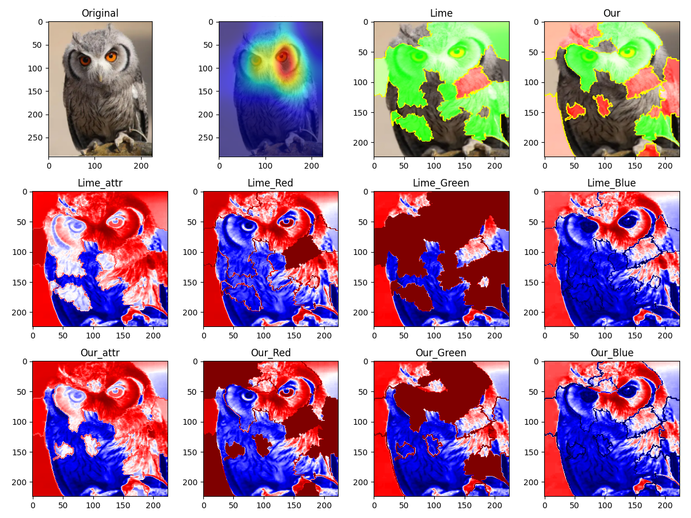
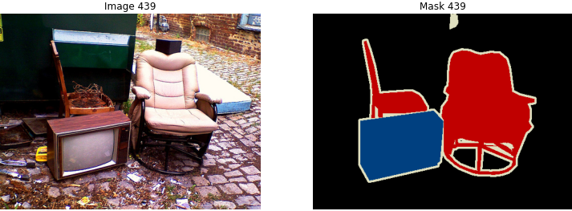
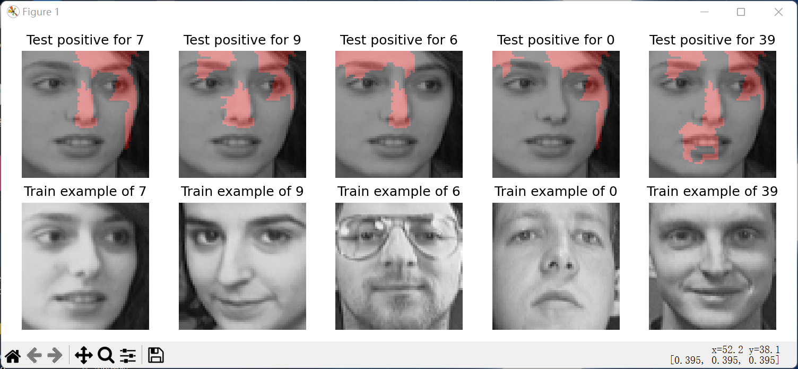
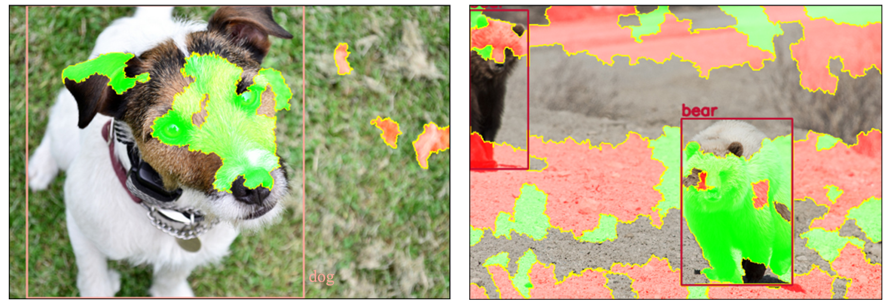

# 项目名称：CamLIME

本项目为论文 **《基于类激活的卷积神经网络局部解释方法研究》**（刘杰东，2025）中所提出方法的官方实现。我们提供了完整的实验代码、环境依赖配置以及运行流程，方便学术复现与二次研究。

> 论文链接：[arXiv / IEEE / ACM / Springer 链接]  
> 联系作者：[1041674453@qq.com]  
> 作者单位：[RAier/计算机科学与工程学院/西安理工大学]

---

## 项目结构说明

```bash
CamLIME/
├── imagenet/                 # ImageNet数据集的标注
├── test_img/                 # 用于代码测试的图片
├── odb_img/                  # 用于图像检测的样本 
├── lime/                     # lime的源码，含自重写 
├── pytorch_grad_cam/         # GradCam的源码，含自重写
├── quantus/                  # Quantus可解释性指标评估工具
├── MyOthersCode/             # CamLIME框架探索过程中其它测试代码，使用时取出放于项目根目录后再运行
├── requirements.txt          # Python依赖列表
├── CAM_LIME.py               # CamLIME核心代码
├── CAM_LIME_w_f.py           # 权重与超像素特征关系曲线
├── CAM_LIME_fues_act.py      # 多个特征层融合激活
├── my_difact.py              # CamLIME框架中不同激活模式对比效果
├── my_diflayer.py            # CamLIME框架中不同激活层对比效果
├── my_difact_diflayer.py     # CamLIME框架中不同激活模式及不同激活层双变量对比效果
├── my_difmodel.py            # CamLIME框架对不同黑盒模型的解释效果
├── my_difExp_vis.py          # CamLIME与部分解释方法的对比
├── my_metrics.py             # 基于Quantus重写的评价指标
├── my_Complexity.py          # CamLIME与其他解释方法的复杂度比较
├── my_Faithfulness.py        # CamLIME与其他解释方法的忠实性比较
├── Quantus_CamLime_all.py    # 用Quantus库测试CamLIME的六类指标分数
├── Quantus_CamLime_test.py   # CamLIME的特征工程应用
├── CamLIME_Face.py           # CamLIME的人脸识别应用
├── CamLIME_Obd.py            # CamLIME的目标检测应用
├── CamLIME_Seg.py            # CamLIME的图像分割应用
├── README.md                 # 项目说明文档
└── LICENSE                   # 开源许可证


```

---

## 环境依赖

本项目基于 Python 开发，推荐使用 Anaconda 或 Virtualenv 搭建虚拟环境。

### 核心依赖及版本（见 `requirements.txt`）：

```txt
python 3.8.18
torch 2.1.2+cu118
torchaudio 2.1.2+cu118
torchvision 0.16.2+cu118
lime  0.2.0.1
torchcam 0.4.0
grad-cam 1.4.5
captum 0.7.0
alibi 0.9.5
ttach 0.0.3
tensorflow 2.12.0  
typing-extensions 4.8
omnixai 1.3.1
zennit 0.5.1
```

### 创建并激活虚拟环境（可选）：

```bash
conda create -n CamLIME python=3.8
conda activate CamLIME
pip install -r requirements.txt
```

---

## 快速开始

### 1. 克隆仓库

```bash
git clone https://github.com/LiuJiedong-Coder/CamLIME.git
cd CamLIME
```

### 2. 下载数据（或使用说明）

请将数据集放置于 `data/` 目录下。

```txt
ImageNet2012数据集下载与处理参考：https://blog.csdn.net/weixin_47160526/article/details/132037269
```


### 3. 训练模型

```txt
python CAM_LIME.py

关键参数：
- 类激活模式选择
parser.add_argument('--method', type=str, default='gradcam',
                  choices=[
                        'gradcam', 'hirescam', 'gradcam++',
                        'scorecam', 'xgradcam', 'ablationcam',
                        'eigencam', 'eigengradcam', 'layercam',
                        'fullgrad', 'gradcamelementwise'
                  ],
                  help='CAM method')

- 黑盒模型与激活层选择推荐，模型根参数量由小到大
model_mob = models.mobilenet_v2(pretrained=True).eval().to(device)
model_alex = models.alexnet(pretrained=True).eval().to(device)
model_google = models.googlenet(pretrained=True).eval().to(device)
model_res18 = models.resnet18(pretrained=True).eval().to(device)
model1_inc = models.inception_v3(pretrained=True).eval().to(device)
model_dense = models.densenet121(pretrained=True).eval().to(device)
#model_vgg = models.vgg16(pretrained=True).eval().to(device)

target_layers_mob = [model_mob.features[17]]   #mobilenet
target_layers_alex = [model_alex.features[11]]   #alexnet
target_layers_google = [model_google.inception5b]   #googlenet
target_layers_res18 = [model_res18.layer4[-1]]   #resnet18,50
target_layers_inc = [model1_inc.Mixed_7c]   #inception_v3
target_layers_dense = [model_dense.features[-1]]  # vgg / densenet
#target_layers_vgg = [model_vgg.features[-1]]

- CamLIME关键代码与超参
from lime import lime_image_my
explainer = lime_image_my.LimeImageExplainer()
# batch_predict分类预测函数 #num_samples是邻域图像个数
data, labels = explainer.explain_instance_data_label(np.array(trans_C(img_pil)), batch_predict, top_labels=1, hide_color=0, num_samples=50)  
```

### 4. 解释效果评估

```txt
运行 my_Complexity.py、my_Faithfulness.py、Quantus_CamLime_all.py

使用时根据设备情况设置参数
```

---

## 部分实验效果展示

| 不同黑盒模型和不同类激活的解释 | 不同黑盒模型和不同类激活的多对象样本解释 |
|--------|--------|
|  |  |

| 不同类激活模式对 ResNet18 预测结果的解释 | 不同类激活的特征与权重的关系图 |
|--------|--------|
|  |  |

|         CamLIME 不同类激活和 ResNet18 不同激活层的解释         |
|:-------------------------------:|
|  |

|         ResNet18 的层次类激活的融合解释         |
|:-------------------------------:|
|  |

| RGB 特征工程分析 | 图像分割应用 |
|--------|--------|
|  |  |

| 人脸特征解释 | 目标检测应用 |
|--------|--------|
|  |  |

---

## 引用本论文

如果您在研究中使用了本项目的代码，请引用我们论文：

```bibtex
@article{刘杰东,
  title={基于类激活的卷积神经网络局部解释方法研究},
  author={刘杰东},
  journal={Journal Name},
  year={2025},
  volume={xx},
  number={yy},
  pages={zz-zz},
  publisher={Publisher}
}
```

---

## 代码贡献与冲突

```
As contributors and maintainers of this project, we pledge to respect all people who contribute through reporting issues, posting feature requests, updating documentation, submitting pull requests or patches, and other activities.

We are committed to making participation in this project a harassment-free experience for everyone, regardless of level of experience, gender, gender identity and expression, sexual orientation, disability, personal appearance, body size, race, ethnicity, age, or religion.

Examples of unacceptable behavior by participants include the use of sexual language or imagery, derogatory comments or personal attacks, trolling, public or private harassment, insults, or other unprofessional conduct.

Project maintainers have the right and responsibility to remove, edit, or reject comments, commits, code, wiki edits, issues, and other contributions that are not aligned to this Code of Conduct. Project maintainers who do not follow the Code of Conduct may be removed from the project team.

Instances of abusive, harassing, or otherwise unacceptable behavior may be reported by opening an issue or contacting one or more of the project maintainers.

This Code of Conduct is adapted from the Contributor Covenant (https://www.contributor-covenant.org), version 1.0.0, available at https://contributor-covenant.org/version/1/0/0/.
```

---

## 版权与许可证

本项目采用 MIT License 许可。

```
MIT License

Copyright (c) 2025 刘杰东

Permission is hereby granted, free of charge, to any person obtaining a copy of this software and associated documentation files (the "Software"), to deal in the Software without restriction, including without limitation the rights to use, copy, modify, merge, publish, distribute, sublicense, and/or sell copies of the Software, and to permit persons to whom the Software is furnished to do so, subject to the following conditions:

The above copyright notice and this permission notice shall be included in all copies or substantial portions of the Software.
```

---

## 常见问题（FAQ）

1. **Q: 数据集下载失败怎么办？**  
   A: 请确认网络连接或使用国内镜像，或联系作者获取替代链接。

2. **Q: 使用 GPU 训练时报错？**  
   A: 请确认 CUDA 环境与 PyTorch 版本匹配。

3. **Q: 代码中模型结构可以修改吗？**  
   A: 可以，自定义模块见 `./lime` 和 `./pytorch_grad_cam` 及 `./my_metrics.py`。

---

## 贡献与反馈

欢迎提交 Issue 或 Pull Request 进行贡献！如有任何问题或建议，也欢迎通过邮件联系作者。

---

## 主要参考与致谢

本项目部分代码借鉴自以下优秀开源项目和论文实现，特此致谢。

### 参考开源项目

```
- [Source Lime](https://github.com/marcotcr/lime.git)
- [Source CAM](https://github.com/jacobgil/pytorch-grad-cam.git)
- [Source Quantus](https://github.com/understandable-machine-intelligence-lab/Quantus.git)
```

### 参考文献

https://arxiv.org/abs/1602.04938
"Why Should I Trust You?": Explaining the Predictions of Any Classifier

https://arxiv.org/abs/1610.02391
Grad-CAM: Visual Explanations from Deep Networks via Gradient-based Localization Ramprasaath R. Selvaraju, Michael Cogswell, Abhishek Das, Ramakrishna Vedantam, Devi Parikh, Dhruv Batra

https://arxiv.org/abs/2011.08891
Use HiResCAM instead of Grad-CAM for faithful explanations of convolutional neural networks Rachel L. Draelos, Lawrence Carin

https://arxiv.org/abs/1710.11063
Grad-CAM++: Improved Visual Explanations for Deep Convolutional Networks Aditya Chattopadhyay, Anirban Sarkar, Prantik Howlader, Vineeth N Balasubramanian

https://arxiv.org/abs/1910.01279
Score-CAM: Score-Weighted Visual Explanations for Convolutional Neural Networks Haofan Wang, Zifan Wang, Mengnan Du, Fan Yang, Zijian Zhang, Sirui Ding, Piotr Mardziel, Xia Hu

https://ieeexplore.ieee.org/abstract/document/9093360/
Ablation-cam: Visual explanations for deep convolutional network via gradient-free localization. Saurabh Desai and Harish G Ramaswamy. In WACV, pages 972–980, 2020

https://arxiv.org/abs/2008.02312
Axiom-based Grad-CAM: Towards Accurate Visualization and Explanation of CNNs Ruigang Fu, Qingyong Hu, Xiaohu Dong, Yulan Guo, Yinghui Gao, Biao Li

https://arxiv.org/abs/2008.00299
Eigen-CAM: Class Activation Map using Principal Components Mohammed Bany Muhammad, Mohammed Yeasin

http://mftp.mmcheng.net/Papers/21TIP_LayerCAM.pdf
LayerCAM: Exploring Hierarchical Class Activation Maps for Localization Peng-Tao Jiang; Chang-Bin Zhang; Qibin Hou; Ming-Ming Cheng; Yunchao Wei

https://arxiv.org/abs/1905.00780
Full-Gradient Representation for Neural Network Visualization Suraj Srinivas, Francois Fleuret

https://jmlr.org/papers/v24/22-0142.html
Quantus: An Explainable AI Toolkit for Responsible Evaluation of Neural Network Explanations and Beyond
